# EruoFood AI — Master Architecture Blueprint

> **Phase 1 Deliverable — Architecture Only. No implementation code is included.**
> This document is the single source of truth for the platform's design. Implementation begins only after this blueprint is approved.

| | |
|---|---|
| **Project** | EruoFood AI — Enterprise AI-powered Nigerian food platform |
| **Document** | MASTER_PLAN.md |
| **Version** | 1.0.0 (Draft for approval) |
| **Owner** | Lead Software Architect |
| **Status** | 🟡 Awaiting approval |
| **Target scale** | Millions of users, multi-region, high availability |

---

## Table of Contents

1. [Executive Summary](#1-executive-summary)
2. [System Architecture](#2-system-architecture)
3. [DDD Modules (Bounded Contexts)](#3-ddd-modules-bounded-contexts)
4. [Folder Structure](#4-folder-structure)
5. [Database Architecture](#5-database-architecture)
6. [API Architecture](#6-api-architecture)
7. [Security Architecture](#7-security-architecture)
8. [AI Architecture](#8-ai-architecture)
9. [Docker Architecture](#9-docker-architecture)
10. [CI/CD Strategy](#10-cicd-strategy)
11. [Development Roadmap](#11-development-roadmap)
12. [Architecture Decision Records (ADR) Index](#12-architecture-decision-records-adr-index)
13. [Glossary](#13-glossary)

---

## 1. Executive Summary

### 1.1 What EruoFood AI Is

EruoFood AI is a production-grade platform for discovering, ordering, and delivering Nigerian food. It serves three primary audiences through a shared backend:

- **Customers** — browse restaurants and dishes, receive AI-driven recommendations, order, pay, and track delivery (Web via React, Mobile via Flutter).
- **Vendors / Restaurants** — manage menus, inventory, pricing, promotions, and order fulfilment.
- **Riders / Logistics** — accept, batch, and complete deliveries with live tracking.
- **Operations / Admin** — moderation, support, analytics, and platform configuration.

### 1.2 Architectural Philosophy

We adopt a **Modular Monolith** built with **Domain-Driven Design (DDD)**, **Clean Architecture**, and **SOLID** principles. This deliberately avoids premature microservices while enforcing strict module boundaries so that any bounded context can later be extracted into an independent service with minimal churn.

**Guiding principles**

| Principle | Application |
|---|---|
| **Clean Architecture** | Dependencies point inward. Domain has zero framework dependencies. |
| **DDD** | Business logic organized around bounded contexts, aggregates, and a ubiquitous language. |
| **SOLID** | Small, single-responsibility classes; dependency inversion via interfaces. |
| **Repository Pattern** | Persistence is abstracted behind domain-owned interfaces. |
| **Service / Application Layer** | Use cases orchestrate domain logic; controllers stay thin. |
| **Dependency Injection** | Laravel's container binds interfaces to implementations per module. |
| **Modular Monolith** | One deployable, many isolated modules communicating via contracts and events. |
| **PSR Standards** | PSR-1/4/12 (style & autoloading), PSR-3 (logging), PSR-7/15 (HTTP middleware), PSR-11 (container). |

### 1.3 Why Modular Monolith (not microservices) for launch

- **Faster time-to-market** — one codebase, one deploy pipeline, one transactional database.
- **Lower operational cost** — no service mesh, no distributed tracing sprawl on day one.
- **Strong consistency** — order + payment + inventory can share DB transactions where correctness demands it.
- **Evolvability** — modules expose contracts and communicate through a domain event bus, so extraction to microservices is a refactor, not a rewrite.

> **Rule:** A module may only touch another module through its published **Contracts** (interfaces / DTOs) or through **domain events** — never by reaching into another module's internal classes or tables.

---

## 2. System Architecture

### 2.1 High-Level System Context

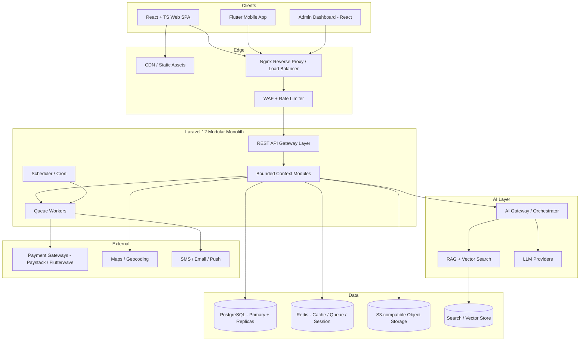

### 2.2 Clean Architecture Layers

Each module is internally structured in four concentric layers. **Dependencies always point inward.**

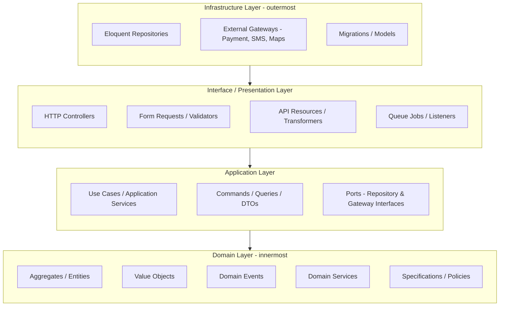

| Layer | Responsibility | May depend on | Framework-aware? |
|---|---|---|---|
| **Domain** | Pure business rules, invariants, entities, value objects, domain events | Nothing | ❌ No Laravel |
| **Application** | Use cases, orchestration, transactions, ports (interfaces) | Domain | ❌ Framework-agnostic |
| **Interface** | HTTP controllers, requests, resources, jobs, CLI | Application | ✅ Yes |
| **Infrastructure** | Repository implementations, DB, external service adapters | Application (implements ports) | ✅ Yes |

### 2.3 Runtime Topology

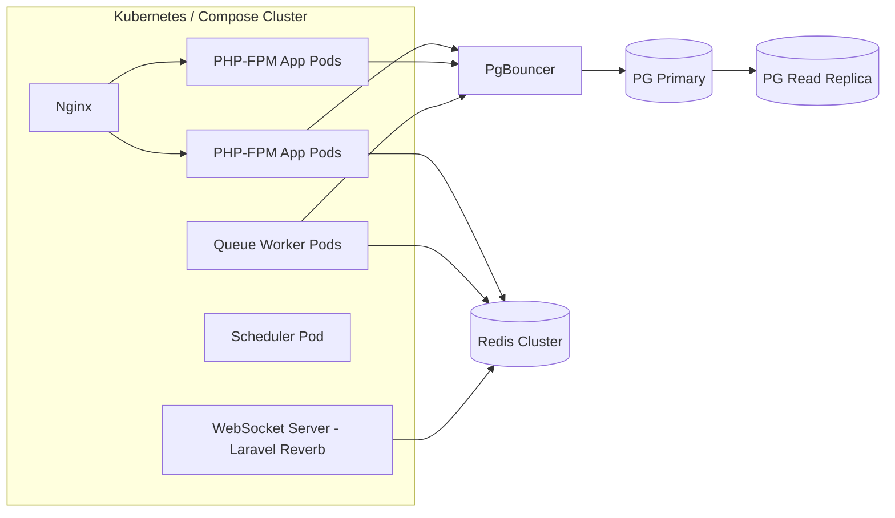

**Key runtime decisions**

- **Read/Write splitting** — writes to primary, reads to replicas for read-heavy paths (catalog, search).
- **PgBouncer** — connection pooling to survive thousands of concurrent PHP-FPM workers.
- **Stateless app tier** — sessions/cache in Redis; app pods horizontally scalable and disposable.
- **Async everywhere it matters** — notifications, AI enrichment, receipts, and webhooks go through queues.
- **Real-time** — Laravel Reverb (WebSockets) for order tracking and rider location, backed by Redis pub/sub.

---

## 3. DDD Modules (Bounded Contexts)

The platform is decomposed into bounded contexts. Each is a self-contained module owning its domain, data, and contracts.

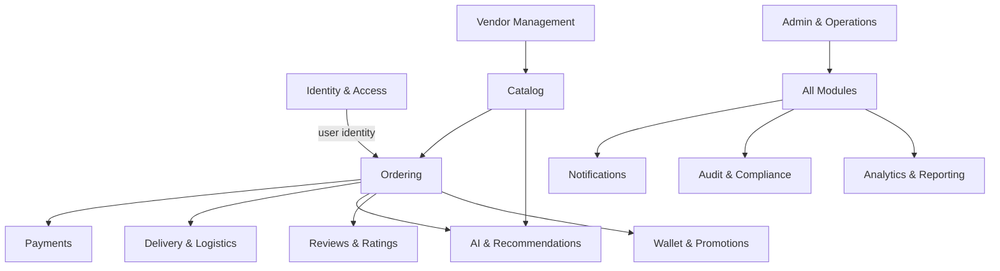

### 3.1 Core Bounded Contexts

| # | Module | Responsibility | Key Aggregates | Publishes Events |
|---|---|---|---|---|
| 1 | **Identity & Access (IAM)** | Registration, auth, roles, permissions, sessions, KYC | `User`, `Role`, `Profile` | `UserRegistered`, `UserVerified` |
| 2 | **Vendor Management** | Restaurant onboarding, profiles, operating hours, payouts config | `Vendor`, `Branch`, `Payout` | `VendorApproved`, `VendorSuspended` |
| 3 | **Catalog** | Menus, dishes, categories, modifiers, pricing, availability, inventory | `Menu`, `Dish`, `Category`, `Inventory` | `DishPublished`, `StockDepleted` |
| 4 | **Ordering** | Cart, checkout, order lifecycle, order state machine | `Order`, `Cart`, `OrderLine` | `OrderPlaced`, `OrderConfirmed`, `OrderCancelled` |
| 5 | **Payments** | Payment intents, gateway integration, refunds, reconciliation | `Payment`, `Refund`, `Transaction` | `PaymentSucceeded`, `PaymentFailed`, `RefundIssued` |
| 6 | **Delivery & Logistics** | Rider assignment, routing, live tracking, proof of delivery | `Delivery`, `Rider`, `Route` | `DeliveryAssigned`, `DeliveryCompleted` |
| 7 | **AI & Recommendations** | Recommendations, search ranking, chatbot, personalization | `Recommendation`, `Conversation` | `RecommendationServed` |
| 8 | **Reviews & Ratings** | Ratings, reviews, moderation signals | `Review`, `Rating` | `ReviewPublished` |
| 9 | **Wallet & Promotions** | Wallets, coupons, loyalty, referrals, discounts | `Wallet`, `Coupon`, `LoyaltyAccount` | `WalletCredited`, `CouponRedeemed` |
| 10 | **Notifications** | Email, SMS, push, in-app; templating & delivery | `Notification`, `Template` | `NotificationSent` |
| 11 | **Analytics & Reporting** | Read models, dashboards, KPIs, exports | `Report`, projections | — (consumer) |
| 12 | **Admin & Operations** | Back-office, moderation, config, feature flags, support | `Ticket`, `FeatureFlag` | `TicketResolved` |
| 13 | **Audit & Compliance** | Immutable audit trail, data-subject requests, retention | `AuditLog` | — (consumer) |

### 3.2 Shared Kernel

A minimal **Shared Kernel** holds cross-cutting primitives used by every module — kept intentionally small to avoid coupling.

- **Value Objects:** `Money` (amount + currency, Naira-aware), `Email`, `PhoneNumber` (Nigerian MSISDN validation), `Address`, `GeoCoordinate`, `Uuid`, `Slug`.
- **Contracts:** `DomainEvent`, `AggregateRoot`, `Repository<T>`, `Clock`, `EventBus`, `UnitOfWork`.
- **Result / Error types:** typed `Result` object and domain exception hierarchy.

### 3.3 Context Map (relationships)

| Relationship | Pattern | Notes |
|---|---|---|
| Ordering → Catalog | Customer/Supplier | Ordering reads prices/availability via Catalog contract at checkout. |
| Ordering → Payments | Customer/Supplier | Payment intent created on checkout; result via event. |
| Ordering → Delivery | Customer/Supplier | Delivery requested on `OrderConfirmed`. |
| Ordering ↔ AI | Open Host Service | AI consumes order history; serves recommendations via API. |
| All → Notifications | Published Language | Fire-and-forget via events. |
| All → Audit | Conformist | Audit subscribes to all domain events. |

### 3.4 Inter-Module Communication Rules

1. **Synchronous** (in-process): via a module's published **Contract interface**, resolved from the DI container. Used when a caller needs an immediate answer (e.g., price lookup at checkout).
2. **Asynchronous** (decoupled): via **domain events** on an in-process event bus, promoted to queued listeners for side effects. Used for anything that can be eventually consistent (notifications, analytics, AI enrichment).
3. **No shared tables** — each module owns its tables; cross-module reads happen through contracts, not JOINs across boundaries. (Enforced via schema conventions and code review; see §5.)

---

## 4. Folder Structure

### 4.1 Monorepo Top Level

```
eruofood-ai/
├── apps/
│   ├── api/                       # Laravel 12 backend (modular monolith)
│   ├── web/                       # React + TypeScript + Vite (customer + admin)
│   └── mobile/                    # Flutter app (customer + rider)
├── packages/                      # Shared cross-app packages
│   ├── api-contracts/             # OpenAPI spec + generated TS types
│   └── ui-kit/                    # Shared React design system (optional)
├── infra/
│   ├── docker/                    # Dockerfiles, compose files
│   ├── nginx/                     # Nginx configs
│   ├── k8s/                       # Kubernetes manifests / Helm (later phase)
│   └── terraform/                 # IaC for cloud resources (later phase)
├── docs/
│   ├── adr/                       # Architecture Decision Records
│   ├── api/                       # API docs
│   └── diagrams/
├── .github/workflows/             # CI/CD pipelines
├── MASTER_PLAN.md
└── README.md
```

### 4.2 Laravel Backend — Modular Structure (`apps/api/`)

```
apps/api/
├── app/
│   ├── Providers/                 # App-wide service providers
│   └── Shared/                    # Framework glue only (thin)
├── modules/                       # ⭐ Bounded contexts live here
│   └── Ordering/                  # Example module (mirrors all modules)
│       ├── Domain/                # Layer 1 — pure PHP, no Laravel
│       │   ├── Entity/            #   Order.php, OrderLine.php
│       │   ├── ValueObject/       #   OrderStatus.php, OrderId.php
│       │   ├── Event/             #   OrderPlaced.php
│       │   ├── Service/           #   OrderPricingService.php (domain svc)
│       │   ├── Repository/        #   OrderRepository.php (interface/port)
│       │   ├── Exception/         #   OrderNotFoundException.php
│       │   └── Specification/     #   CanBeCancelledSpecification.php
│       ├── Application/           # Layer 2 — use cases
│       │   ├── Command/           #   PlaceOrderCommand.php + Handler
│       │   ├── Query/             #   GetOrderQuery.php + Handler
│       │   ├── DTO/               #   OrderDTO.php
│       │   └── Port/              #   PaymentGatewayPort.php (interface)
│       ├── Infrastructure/        # Layer 4 — implementations
│       │   ├── Persistence/
│       │   │   ├── Eloquent/      #   EloquentOrderRepository.php, models
│       │   │   └── Migration/     #   module-scoped migrations
│       │   ├── Gateway/           #   adapters to Payments contract, etc.
│       │   └── Provider/          #   OrderingServiceProvider.php (DI bindings)
│       ├── Interface/             # Layer 3 — delivery mechanisms
│       │   ├── Http/
│       │   │   ├── Controller/    #   OrderController.php (thin)
│       │   │   ├── Request/       #   PlaceOrderRequest.php (validation)
│       │   │   ├── Resource/      #   OrderResource.php (transformer)
│       │   │   └── routes.php     #   module route file
│       │   ├── Console/           #   Artisan commands
│       │   └── Listener/          #   queued event listeners
│       ├── Contracts/             # ⭐ Public API of the module (interfaces + DTOs)
│       │   └── OrderingContract.php
│       └── Tests/                 # Unit + feature tests co-located
├── modules/Shared/                # Shared Kernel (Money, Email, EventBus…)
├── bootstrap/, config/, public/, storage/  # standard Laravel
├── database/                      # cross-cutting seeders only
├── composer.json                  # PSR-4 maps each module namespace
└── phpunit.xml
```

**PSR-4 autoloading (illustrative `composer.json` mapping):**

```
"autoload": {
  "psr-4": {
    "App\\": "app/",
    "EruoFood\\Ordering\\": "modules/Ordering/",
    "EruoFood\\Catalog\\":  "modules/Catalog/",
    "EruoFood\\Shared\\":   "modules/Shared/"
  }
}
```

Each module registers its own `ServiceProvider` (routes, DI bindings, migrations, events), so a module is plug-in shaped and could be lifted out cleanly.

### 4.3 React Frontend (`apps/web/`)

```
apps/web/
├── src/
│   ├── app/                    # App shell, providers, router
│   ├── features/               # Feature-sliced (mirrors backend contexts)
│   │   ├── ordering/
│   │   │   ├── api/            # RTK Query / TanStack Query hooks
│   │   │   ├── components/
│   │   │   ├── hooks/
│   │   │   ├── types/          # generated from OpenAPI
│   │   │   └── pages/
│   │   ├── catalog/
│   │   └── auth/
│   ├── shared/                 # ui-kit, utils, hooks, api client
│   ├── lib/                    # axios/fetch client, interceptors
│   └── config/
├── public/
├── vite.config.ts
├── tsconfig.json
└── package.json
```

### 4.4 Flutter App (`apps/mobile/`)

```
apps/mobile/lib/
├── core/                       # DI (get_it), theming, routing, network
├── features/                   # feature-first, Clean Architecture per feature
│   └── ordering/
│       ├── domain/             # entities, repositories (abstract), usecases
│       ├── data/               # models, datasources, repository impls
│       └── presentation/       # widgets, pages, bloc/riverpod state
├── shared/
└── main.dart
```

---

## 5. Database Architecture

### 5.1 Principles

- **PostgreSQL 16** as the system of record; **Redis** for cache, sessions, queues, rate limiting, and pub/sub.
- **Schema-per-context (logical ownership):** each bounded context owns its tables with a table-name prefix (e.g. `ordering_orders`, `catalog_dishes`). Postgres schemas (namespaces) may be used per module for hard isolation.
- **No cross-context foreign keys.** References across contexts are by **ID only** (soft references), preserving module autonomy and future extractability. Integrity across contexts is enforced in the application/domain layer.
- **UUIDv7** primary keys for public-facing, distributable identifiers (time-ordered, index-friendly); internal auto-increment allowed where never exposed.
- **Repository Pattern** is the only way the app touches persistence — no Eloquent calls leak into domain/application layers.

### 5.2 Read/Write Strategy

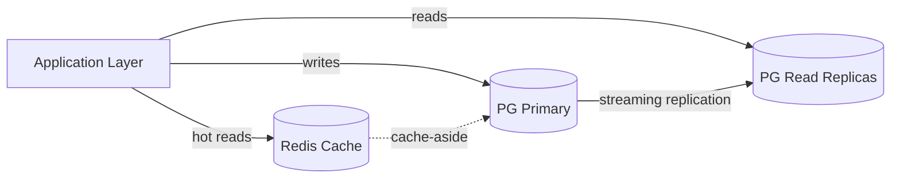

- **CQRS-lite:** commands hit the primary; heavy read models (catalog, search, analytics) use replicas and denormalized **projections** built from domain events.
- **Caching layers:** cache-aside for catalog & vendor data; write-through invalidation on `DishPublished` / price changes.
- **Sharding readiness:** tenant/vendor-oriented keys chosen so partitioning by `vendor_id` or geography is possible later.

### 5.3 Core Logical Data Model (selected)

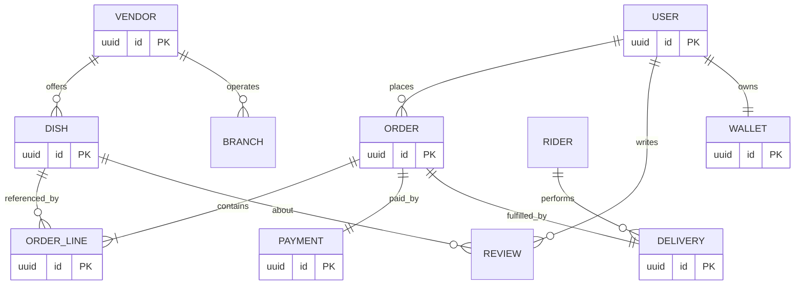

> Diagram shows conceptual relationships. Physically, cross-context links (e.g. `ORDER.user_id`, `ORDER_LINE.dish_id`) are **soft ID references**, not DB-level foreign keys across schemas.

### 5.4 Data Integrity & Reliability

| Concern | Approach |
|---|---|
| **Money** | Stored as `bigint` minor units (kobo) + currency code. Never floats. |
| **Concurrency** | Optimistic locking (`version` column) on aggregates like `Order`, `Inventory`. |
| **Atomicity across side-effects** | **Transactional Outbox** pattern — domain events written in the same DB transaction, dispatched by a relay to the queue. |
| **Idempotency** | Idempotency keys on payment/webhook endpoints; unique constraints on `(gateway, reference)`. |
| **Auditability** | Append-only `audit_logs`; immutable, hash-chained per compliance needs. |
| **Migrations** | Module-scoped, versioned, reversible; expand/contract pattern for zero-downtime. |
| **Backups** | Automated daily snapshots + PITR (WAL archiving) to S3; tested restore runbooks. |
| **Soft deletes & retention** | Soft deletes where recoverable; scheduled hard-delete for data-retention/PII compliance. |

### 5.5 Search & Vector Data

- **Full-text search:** PostgreSQL `tsvector` + GIN indexes for catalog; upgrade path to OpenSearch/Meilisearch if needed.
- **Vector store:** **pgvector** extension for embeddings (semantic dish/vendor search, recommendations, RAG) — keeps vectors co-located with Postgres initially; can migrate to a dedicated vector DB (Qdrant/Milvus) at scale.

---

## 6. API Architecture

### 6.1 Style & Standards

- **REST-first**, versioned, resource-oriented, JSON. Designed so a **GraphQL** gateway can be layered later over the same application services (no rewrite of business logic).
- **Versioning:** URI-based (`/api/v1/...`) with additive, backward-compatible evolution; deprecation policy with sunset headers.
- **Consistency:** all endpoints follow the same envelope, error format, pagination, and filtering conventions.
- **Contract-first:** an **OpenAPI 3.1** spec is authored/generated and published in `packages/api-contracts`; TypeScript and Dart types are generated from it so web, mobile, and backend never drift.

### 6.2 Layered Request Flow

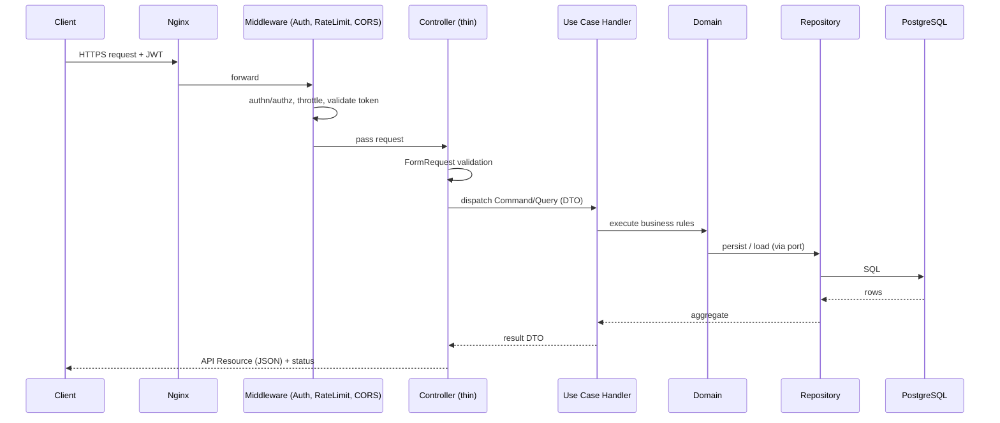

### 6.3 Standard Response Envelope

**Success**
```
{
  "data": { ... },
  "meta": { "requestId": "...", "timestamp": "..." }
}
```

**Paginated**
```
{
  "data": [ ... ],
  "meta": { "page": 1, "perPage": 20, "total": 340 },
  "links": { "next": "...", "prev": null }
}
```

**Error (RFC 7807 Problem Details-aligned)**
```
{
  "error": {
    "type": "https://eruofood.ai/errors/validation",
    "code": "VALIDATION_FAILED",
    "message": "The given data was invalid.",
    "details": [ { "field": "email", "issue": "required" } ],
    "requestId": "..."
  }
}
```

### 6.4 API Surface (representative)

| Domain | Method & Path | Purpose |
|---|---|---|
| Auth | `POST /api/v1/auth/register`, `/login`, `/refresh`, `/logout` | Identity |
| Catalog | `GET /api/v1/vendors`, `/vendors/{id}/menu`, `/dishes/{id}` | Browse |
| Search | `GET /api/v1/search?q=` | Text + semantic search |
| Cart | `POST /api/v1/cart/items`, `GET /api/v1/cart` | Cart mgmt |
| Ordering | `POST /api/v1/orders`, `GET /api/v1/orders/{id}` | Checkout & tracking |
| Payments | `POST /api/v1/payments/intent`, `POST /api/v1/payments/webhook` | Pay & reconcile |
| Delivery | `GET /api/v1/deliveries/{id}/track` (WS) | Live tracking |
| AI | `POST /api/v1/ai/recommendations`, `POST /api/v1/ai/chat` | Personalization |
| Vendor | `POST /api/v1/vendor/dishes`, `PATCH /api/v1/vendor/orders/{id}` | Vendor ops |
| Admin | `GET /api/v1/admin/...` | Back-office |

### 6.5 Cross-Cutting API Concerns

- **Rate limiting & quotas** — Redis token-bucket per user/IP/route class; stricter tiers for AI endpoints.
- **Idempotency** — `Idempotency-Key` header honored on all non-safe mutating endpoints.
- **Pagination** — cursor-based for large/real-time lists; offset for admin tables.
- **Filtering/sorting** — allow-listed fields only (prevents injection & abuse).
- **Documentation** — Swagger/Scalar UI served from the OpenAPI spec; Postman collection generated.
- **Webhooks (outbound)** — signed (HMAC), retried with backoff, delivered from queue.
- **Real-time** — WebSocket channels (Laravel Reverb) for order status and rider location, authorized per-user.

---

## 7. Security Architecture

### 7.1 Defense-in-Depth Overview

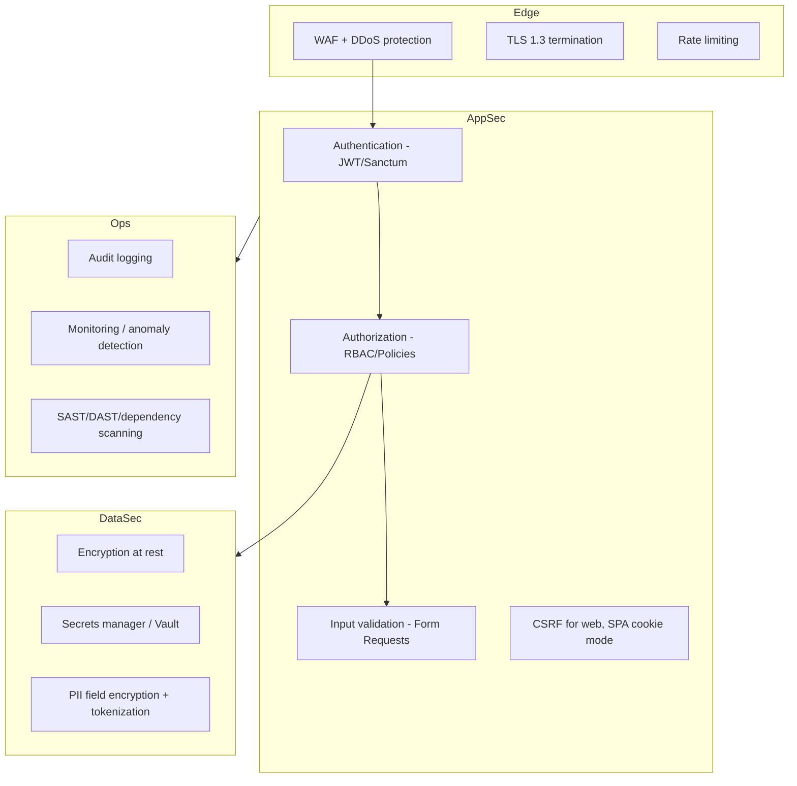

### 7.2 Authentication & Authorization

| Aspect | Approach |
|---|---|
| **Mobile / SPA auth** | **Laravel Sanctum** (SPA cookie sessions for web) + token-based/JWT for Flutter & third parties. |
| **Tokens** | Short-lived access tokens + rotating refresh tokens; revocation list in Redis. |
| **Passwords** | Argon2id hashing; breach-password check; strong policy. |
| **MFA** | TOTP / SMS OTP for sensitive roles (vendors, admins, payouts). |
| **Authorization** | **RBAC** with fine-grained **Policies/Gates** per aggregate; permission checks in the application layer, not just controllers. |
| **Roles** | `customer`, `vendor_owner`, `vendor_staff`, `rider`, `support`, `admin`, `super_admin`. |
| **Least privilege** | Scoped tokens (abilities) so a rider token can't touch vendor endpoints. |

### 7.3 Application & Data Protection

- **OWASP Top 10 & API Security Top 10** used as the baseline checklist for every module.
- **Input validation** at the edge (Form Requests) + domain invariants (defense in depth).
- **SQL injection** — parameterized queries only (Eloquent/Query Builder); no raw string interpolation.
- **XSS/CSRF** — output encoding on clients; CSRF protection for cookie-based web flows; strict CORS allow-list.
- **Encryption** — TLS 1.3 in transit; AES-256 at rest (DB volumes, S3 SSE); application-level encryption for PII (phone, address).
- **Secrets** — never in code or images; injected via secrets manager / environment; rotated regularly.
- **Payment security** — never store raw card data; delegate to PCI-DSS-compliant gateways (Paystack/Flutterwave); verify webhook signatures.
- **File uploads** — type/size validation, AV scanning, stored in private S3 buckets with signed URLs.
- **Rate limiting & abuse** — per-endpoint throttling, bot detection, and progressive challenges on auth endpoints.

### 7.4 Privacy, Compliance & Governance

- **NDPR** (Nigeria Data Protection Regulation) and **GDPR-style** rights: consent, access, export, and erasure (data-subject requests handled via Audit & Compliance module).
- **Data classification** — public / internal / confidential / restricted (PII, payment) with handling rules per class.
- **Audit trail** — immutable, tamper-evident logs of security-relevant and financial actions.
- **Least data** — collect only what's needed; retention schedules with automated purging.

### 7.5 Secure SDLC

- **SAST** (static analysis), **dependency scanning** (Composer/npm/pub audit), **secret scanning**, and **container image scanning** run in CI on every PR.
- **DAST** against staging on a schedule.
- **Security review gate** for changes touching auth, payments, or PII.
- **Principle:** security defects block merge; no exceptions for auth/payment paths.

---

## 8. AI Architecture

### 8.1 Goals

The AI layer powers **personalized recommendations**, **semantic search**, a **conversational food assistant** (Nigerian cuisine aware), **smart re-ordering**, **fraud/anomaly signals**, and **vendor-side demand insights** — all behind a single **AI Gateway** so providers/models are swappable and cost-controlled.

### 8.2 AI Layer Design

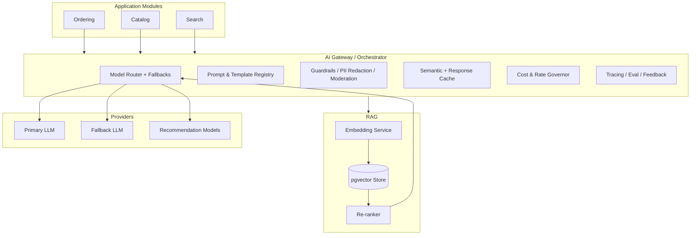

### 8.3 Capabilities & Techniques

| Capability | Technique |
|---|---|
| **Recommendations** | Hybrid: collaborative filtering + content-based + embeddings; re-ranked by context (time, location, weather, budget). |
| **Semantic search** | Query → embedding → pgvector ANN → re-rank → results. Handles "spicy jollof near me under ₦3000". |
| **Food assistant (chat)** | RAG over menus/vendor data + tools (place order, check status) with strict tool authorization. |
| **Smart re-order** | Sequence models over order history; "order your usual". |
| **Demand forecasting** | Time-series per vendor/dish for inventory & staffing (vendor insights). |
| **Fraud/anomaly** | Signals feeding Payments/Delivery (unusual patterns, velocity checks). |
| **Content moderation** | Review/image moderation before publication. |

### 8.4 AI Engineering Principles

- **Provider-agnostic:** the AI Gateway abstracts model providers behind a port; models are configured, not hard-coded. Primary + fallback with automatic failover.
- **Guardrails:** input/output moderation, **PII redaction before any external call**, prompt-injection defenses, and allow-listed tools with per-tool authorization.
- **Grounding:** RAG grounds answers in EruoFood's own catalog/vendor data to reduce hallucination; responses cite sources internally.
- **Caching & cost control:** semantic cache for repeated queries; per-user and per-endpoint budgets; token accounting and alerts.
- **Async by default:** heavy AI enrichment (embeddings, batch recommendations) runs on queues; user-facing calls are latency-budgeted with graceful fallback to non-AI results.
- **Human-in-the-loop:** feedback capture (thumbs, conversions) feeds evaluation and ranking.
- **Evaluation:** offline eval sets + online A/B testing; every AI feature ships behind a **feature flag** with measurable success metrics.
- **Privacy:** training/fine-tuning only on consented, anonymized data; clear data-usage boundaries with providers.

### 8.5 Data Flow (recommendation example)

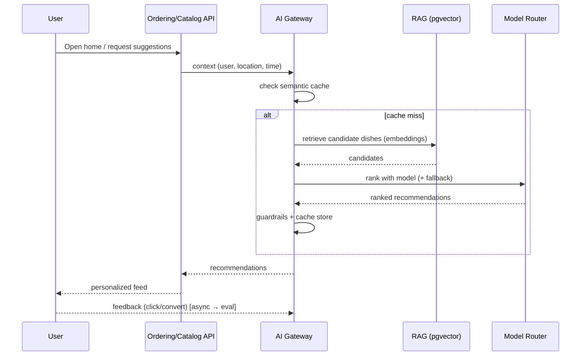

---

## 9. Docker Architecture

### 9.1 Principles

- **Parity:** dev, staging, and prod run the same images; only configuration/secrets differ.
- **Multi-stage builds:** small, hardened runtime images; build tooling never ships to prod.
- **Non-root containers**, read-only filesystems where possible, health checks on every service.
- **12-Factor:** config via environment; logs to stdout; stateless app containers.

### 9.2 Service Composition

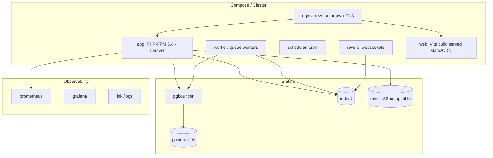

### 9.3 Images & Stages

| Service | Base | Stages | Notes |
|---|---|---|---|
| **app (API)** | `php:8.4-fpm-alpine` | vendor build → app runtime | OPcache + JIT tuned; extensions: pdo_pgsql, redis, gd, bcmath, pcntl. |
| **worker** | same image as app | — | Runs `queue:work` with supervisor; separate scaling. |
| **scheduler** | same image as app | — | Runs `schedule:run` via cron. |
| **reverb** | same image as app | — | WebSocket server process. |
| **web** | `node:22-alpine` → `nginx:alpine` | build → static | Vite build output served by Nginx/CDN. |
| **nginx** | `nginx:alpine` | — | TLS, gzip/brotli, static caching, upstream to PHP-FPM. |
| **postgres** | `postgres:16-alpine` | — | Tuned config, persistent volume, PITR. |
| **redis** | `redis:7-alpine` | — | AOF persistence, maxmemory policy. |
| **minio** | `minio` | — | Local S3 for dev/staging; real S3 in prod. |

### 9.4 Environments

- **Local dev:** `docker compose` with hot reload (Vite dev server, `php artisan serve`/FPM), MinIO, Mailpit for email testing, seeded data.
- **Staging:** production-like images, real managed Postgres/Redis/S3, feature flags on, synthetic data.
- **Production:** orchestrated (Docker Swarm to start, Kubernetes/Helm as scale demands — manifests in `infra/k8s`), autoscaling app/worker tiers, managed data services, CDN in front of static + media.

### 9.5 Operational Concerns

- **Health & readiness probes** on every service; graceful shutdown for zero-dropped-requests deploys.
- **Resource limits** (CPU/memory) per container; horizontal autoscaling on app & workers.
- **Zero-downtime deploys** via rolling updates + expand/contract migrations.
- **Observability:** Prometheus metrics, Grafana dashboards, centralized logs (Loki/ELK), and distributed tracing (OpenTelemetry) — wired from day one.

---

## 10. CI/CD Strategy

### 10.1 Pipeline Overview

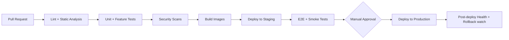

### 10.2 Quality Gates (run on every PR)

| Stage | Backend (Laravel) | Frontend (React) | Mobile (Flutter) |
|---|---|---|---|
| **Format/Lint** | Laravel Pint (PSR-12), PHPStan/Larastan (max level) | ESLint + Prettier, `tsc --noEmit` | `dart format`, `flutter analyze` |
| **Tests** | PHPUnit/Pest (unit + feature), ≥ 80% on domain/application | Vitest + Testing Library | `flutter test` |
| **Contract** | OpenAPI lint + breaking-change check | Types generated from spec verified | Generated Dart models verified |
| **Security** | `composer audit`, SAST, secret scan | `npm audit`, SAST | `pub audit` |
| **Build** | Docker image builds & image scan | Vite production build | APK/IPA build (release lanes) |

**Merge is blocked** unless all gates pass and the PR is reviewed. Auth/payment/PII changes require an additional security review.

### 10.3 Branching & Release

- **Trunk-based** with short-lived feature branches and PRs (`claude/...` / `feature/...`).
- **Environments:** every PR gets checks; merge to `main` deploys to **staging** automatically; **production** deploys on tagged release with manual approval.
- **Versioning:** semantic versioning for API and releases; changelog generated.
- **Migrations:** expand/contract, applied automatically with safety checks; destructive steps gated.

### 10.4 Deployment & Safety

- **Strategy:** rolling updates by default; **blue-green / canary** for high-risk releases (payments).
- **Rollback:** one-command rollback to previous image; DB changes designed to be backward compatible during the deploy window.
- **Feature flags:** ship dark, enable gradually, kill-switch for AI and risky features.
- **Post-deploy verification:** automated smoke tests + health checks; auto-rollback on failure thresholds.
- **Observability tie-in:** deploy markers in dashboards; alerting on error-rate/latency regressions (SLOs).

### 10.5 Tooling

- **CI/CD:** GitHub Actions (workflows in `.github/workflows`).
- **Registry:** container registry for versioned images.
- **IaC:** Terraform for cloud resources; Helm for Kubernetes (later phase).
- **Secrets:** injected from a secrets manager into CI and runtime — never committed.

---

## 11. Development Roadmap

Phased, dependency-ordered delivery. Each phase ends with a demoable, tested increment behind feature flags.

### Phase 0 — Foundation & Scaffolding
**Goal:** Walking skeleton and guardrails before feature work.
- Monorepo layout, Docker dev environment, Nginx, Postgres, Redis, MinIO.
- Laravel modular skeleton (Shared Kernel, module conventions, DI wiring), one thin vertical slice end-to-end.
- CI pipeline (lint, static analysis, tests, security scans), coding standards (PSR-12/Pint/PHPStan).
- OpenAPI contract tooling + type generation for web/mobile.
- **Exit:** "health check" feature flows through all layers; CI green; images build.

### Phase 1 — Identity & Vendor Foundations
**Goal:** Who can use the platform and who sells food.
- IAM module: registration, login, Sanctum tokens, RBAC, roles/policies, MFA scaffolding.
- Vendor Management: onboarding, profiles, branches, operating hours, approval workflow.
- Admin shell: back-office login, vendor approval.
- **Exit:** Vendors can be onboarded and approved; users can authenticate securely.

### Phase 2 — Catalog & Search
**Goal:** Browsable food.
- Catalog module: menus, dishes, categories, modifiers, pricing, availability, inventory.
- Full-text search (tsvector); media uploads to S3 with signed URLs.
- Web + mobile browse experiences.
- **Exit:** Customers can browse vendors and menus; vendors manage catalog.

### Phase 3 — Ordering & Payments
**Goal:** Core transaction — the revenue path.
- Ordering module: cart, checkout, order state machine, transactional outbox.
- Payments module: Paystack/Flutterwave integration, intents, webhooks (signed, idempotent), refunds, reconciliation.
- Wallet & Promotions (coupons, loyalty basics).
- **Exit:** A customer can place and pay for an order end-to-end, reliably.

### Phase 4 — Delivery & Real-Time
**Goal:** Fulfilment and live tracking.
- Delivery module: rider assignment, routing, proof of delivery.
- Real-time tracking via Laravel Reverb (order status + rider location).
- Rider app flows (Flutter).
- **Exit:** Orders are dispatched, tracked live, and completed.

### Phase 5 — AI & Personalization
**Goal:** Differentiation.
- AI Gateway, embeddings + pgvector, semantic search, recommendations, food assistant (RAG).
- Guardrails, caching, cost governance, evaluation harness, A/B testing.
- **Exit:** Personalized recommendations and semantic search measurably improve conversion.

### Phase 6 — Reviews, Notifications & Analytics
**Goal:** Trust, engagement, insight.
- Reviews & Ratings with moderation.
- Notifications (email/SMS/push/in-app) across all events.
- Analytics & Reporting projections and dashboards; vendor insights.
- **Exit:** Feedback loop, communications, and operational dashboards live.

### Phase 7 — Hardening & Scale
**Goal:** Production readiness at millions of users.
- Read replicas + PgBouncer, caching strategy tuning, load & soak testing.
- Full observability (metrics/logs/traces), SLOs/alerts, DR drills, PITR restore tests.
- Security review, penetration test, compliance (NDPR) sign-off.
- Blue-green/canary deploys; autoscaling policies.
- **Exit:** Meets performance, reliability, and security SLOs; ready for scale.

### Phase 8 — Extensibility & Evolution (ongoing)
- Optional GraphQL gateway over existing application services.
- Extraction of hot bounded contexts into services if/when justified by scale.
- Multi-region, advanced ML (forecasting/fraud), marketplace expansion.

> **Note:** Timelines/staffing are deliberately omitted from this architecture blueprint; they belong in the project plan produced after approval. Ordering is by dependency and risk, not calendar.

---

## 12. Architecture Decision Records (ADR) Index

ADRs will live in `docs/adr/`. Initial set to author on approval:

| ADR | Decision |
|---|---|
| ADR-001 | Modular Monolith over microservices for launch |
| ADR-002 | DDD + Clean Architecture layering per module |
| ADR-003 | PostgreSQL as system of record; schema-per-context; no cross-context FKs |
| ADR-004 | REST-first with OpenAPI contract; GraphQL deferred |
| ADR-005 | Sanctum + JWT auth model and RBAC strategy |
| ADR-006 | Transactional Outbox for reliable event dispatch |
| ADR-007 | AI Gateway abstraction with provider fallback + pgvector RAG |
| ADR-008 | UUIDv7 identifiers and Money-as-minor-units convention |
| ADR-009 | Docker multi-stage images; Swarm→Kubernetes progression |
| ADR-010 | Trunk-based development with expand/contract migrations |
| ADR-0014 | Reviews & Ratings — one context owns every review; ratings out via events |
| ADR-0015 | Loyalty, Rewards & Referrals — one context owns every point; earned from events |
| ADR-0016 | Public API, SDK & Developer Platform — a controlled façade, internals never exposed |

> Delivered ADRs from Milestones 1–16 live in `docs/adr/` (see `0001`–`0016`).

---

## 13. Glossary

| Term | Meaning |
|---|---|
| **Bounded Context** | A boundary within which a domain model and its ubiquitous language are consistent. |
| **Aggregate** | A cluster of domain objects treated as a single unit with an enforced invariant boundary. |
| **Value Object** | An immutable object defined by its attributes (e.g., `Money`, `Address`). |
| **Port / Adapter** | An interface (port) defined by the application, implemented (adapter) in infrastructure. |
| **Repository** | Abstraction over persistence for an aggregate, defined in the domain, implemented in infrastructure. |
| **Use Case / Application Service** | Orchestrates a single business operation across the domain. |
| **Transactional Outbox** | Pattern that writes events in the same DB transaction as state changes for reliable delivery. |
| **CQRS-lite** | Separating read models (projections) from write models without full event sourcing. |
| **RAG** | Retrieval-Augmented Generation — grounding LLM answers in retrieved, trusted data. |
| **Expand/Contract** | Backward-compatible migration technique enabling zero-downtime schema changes. |

---

## Approval

This blueprint defines **what** we will build and **how** it will be structured. **No implementation code has been written.** Upon approval, work proceeds per the roadmap starting at **Phase 0 — Foundation & Scaffolding**, with each ADR authored as its decision is locked in.

**Sign-off required from:** Product · Engineering · Security · Operations

---

*End of MASTER_PLAN.md — Version 1.0.0 (Draft for approval)*
